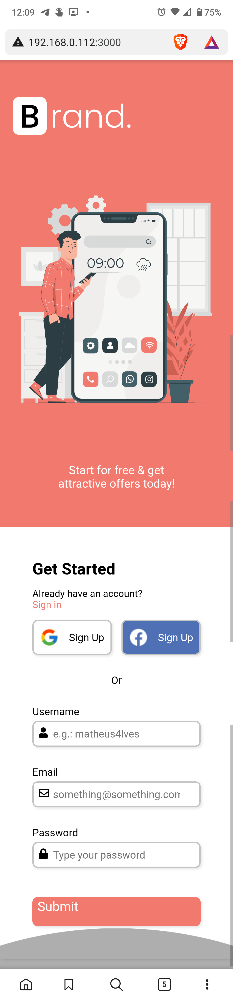

# JS Form Validation Example

## Table of Contents

- [Introduction](#introduction)
- [Description](#description)
- [Demo](#demo)
- [Screenshots](#screenshots)
- [Setup](#setup)
- [Technical info](#technical-info)
  - [DevDependecies](#devdependencies)
  - [Dependencies](#dependencies)
- [Credits](#credits)
- [License](#license)

## Introduction

Client-side form validation is used to improve user experience and to avoid submission of unadequate data to the database. Through the messages displayed, the user should get a good grasp of what he's supposed to type in each field.

## Description

This project does not use HTML's built-in form validation. Instead, it uses JavaScript to provide custom experience.

## Demo

[Client-side JavaScript form validation](https://youtu.be/Pd5ty6ApHZw)

## Screenshots

| Smartphone portrait screenshot                                                              | Smartphone landscape screenshot                                                               |
| ------------------------------------------------------------------------------------------- | --------------------------------------------------------------------------------------------- |
|  |  |

## Setup

To run this project locally, clone this repo to your machine, type `npm install` to install the packages and `npm run dev` to open it in an incognito google chrome window. If you want to use a different browser, change the open property of the devServer object in the **webpack.config.js** file.

## Technical info

### DevDependencies

         

### Dependencies

         

## Credits

The original project can be found here: [Learn JavaScript Form Validation – Build a JS Project for Beginners](https://www.freecodecamp.org/news/learn-javascript-form-validation-by-making-a-form/)

## License

